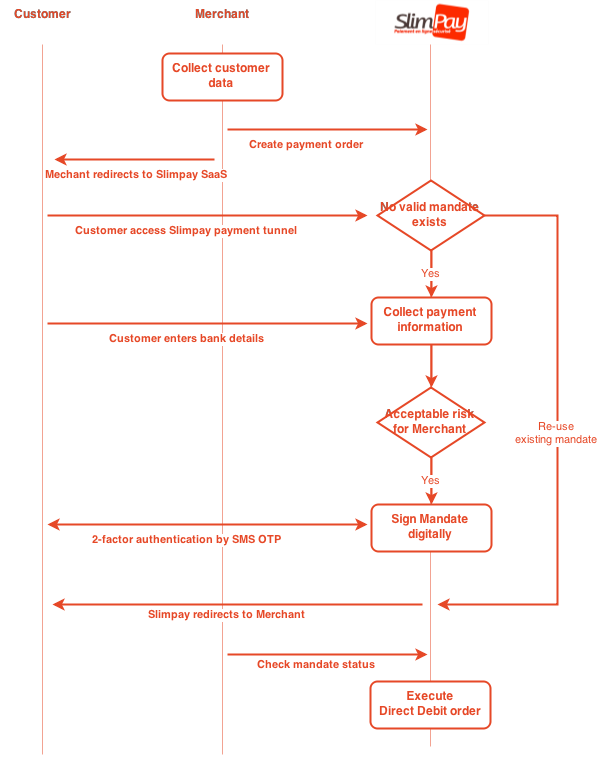

# Getting started

## Introduction

This documentation gives a technical overview of the Slimpay infrastructure and API allowing you to perform direct debit, mandate signature and more...

## Slimpay resources

* **Merchant** uses SlimPay EPT to collect signed mandates from its customers and manage its payment orders. The merchant is the creditor in the payment transaction.
* **Customer** or **User** uses the solution to sign a mandate for a specific merchant. He is considered as a debtor in the payment transaction and a customer of the merchant.
* **API** SlimPay provides a complete RESTful HATEOAS API for mandate signatures and direct debit payments. 

## Sequence diagrams

SlimPay API manages the payment process on behalf of the merchant. It provides an online signature in the framework of SEPA (Single Euro Payment Area). Besides, it offers an evaluation of fraud risk for each transaction and manages an execution of payment orders upon request.

SlimPay API is dedicated to the online merchants whose customers make repetitive or recurrent payments such as for contract subscription. 

SlimPay API will handle the debiting of customers holding a bank account in Europe. Once a mandate has been signed, SlimPay debits the customer upon request of the merchant. The debited amounts can be paid directly to the merchant's account in the bank of his choice. 

The figure below summarizes the signature process and the relations between Customer/Merchant/SlimPay:

## Main use cases

### Direct debit payment

The figure below describes the signature Direct Debit Payment process:

There are 3 variants of this use case:

* **Signature only**

    For this type of request, the merchant has to send a request for signature only. The EPT performs a mandate signature but no direct debit is made. The merchant is in charge of generating the payment orders and sending to SlimPay independently of the signature process. Generally, the merchant transfers regularly the payment order files to SlimPay via a secure way such as SFTP (Secure File Transfer Protocol). The format of the files should be compliant with the format required by SlimPay. 

* **Signature + Immediate single direct debit**

    For this type of request, the merchant has to provide two more mandatory data which are: amount to debit and the date on which the merchant intends to debit. Once the mandate is signed, a debit order is generated by SlimPay and will be executed at the given date (or the earliest date if the delay is too short). This type of request is considered as a mandate signature request combined with a debit order (collectPayment). 

* **Signature + Payment plan (Recurrent debit)**

    For this type of request, the merchant has to provide three additional mandatory data fields:

    - frequency of payment plan (for example: monthly, yearly)
    - date on which the merchant intends to start the first debit amount to debit

    Once the signature has been carried out successfully, the payment plan will be generated and executed automatically according to the data provided previously by the merchant.

    To stop the payment plan, the merchant has to transfer the un-subscription file to SlimPay via SFTP. The format of this file should be compliant with the format required by SlimPay. 

### Direct debit payment combined with card payment

This solution is dedicated to merchants intending to debit their customers by credit card for the first payment instead of a direct debit, the following payments being done in direct debit mode, or the merchants wishing to propose card payments for customers not having a bank account within SEPA.

The figure below describes the signature Direct Debit combined with Card Payment process:

There are 2 variants of this use case:

* **Signature + Immediate card payment (Authorization or Payment)**

    The signature process in this case is slightly different from the previous one.  The merchant can choose the type of card payment operation between **_authorization_** and **_payment_**. The **_authorization_** type will only generate an authorization to debit a requested amount; no real debit will be made. On the other hand the **_payment_** type will generate a real debit. 

    According to Figure 1, at the end of the second step a card authorization request is sent. If the response is positive, the customer continues to the next step. If not, the process is stopped and the customer is redirected to the merchant's website. If the merchant chooses the payment operation, a request for debit will be sent once the signature has been carried out successfully.
    The authorization of card payment is transferred to the merchant with the transaction data. The execution of these card transactions can be done by SlimPay or by the merchant upon request. 

* **Signature + Multiple Card payment (Alias)**

    The idea here is to provide an alternative to the Direct Debit for the customers who do not have an account in the SEPA or have an account in a bank that is not SEPA “Reachable”. This feature does actually not need a separate request type. It is fully compatible with the Direct Debit requests described in chapter 2.2. SlimPay automatically detects that a SEPA mandate cannot be signed and redirects the customer to the credit card page. A credit card alias is created and stored. Any future debits sent by the merchant will automatically be processed using this alias. To benefit from this feature the merchant only needs to ask for activation by SlimPay and provide the same mandatory data as the one described in Section 2.2..

### Card payment only

Merchants generally use this solution as a complement to a subscription paid by direct debits for payment of one-time options or for credit recovering in case of direct debit returns.
The request type is “CardPayment” and the only mandatory information provided by the merchant  is the first name and last name of the customer.

## Where do I start?

### Guides

### API

We strongly encourage you to use our official libraries for navigating and using the Slimpay REST API.

#### PHP

Install from source:

    git clone git@github.com:SlimPay/client-api-rest-php.git

#### Node.js

Install with npm:

    npm install xxx

Check out our [Node docs](#) or [view source on Github](https://github.com/SlimPay/client-api-rest-node).

#### Java

Install with Maven:

    <dependency>
      <groupId>com.slimpay</groupId>
      <artifactId>client-api-rest-java</artifactId>
      <version>0.0.1</version>
    </dependency>

Check out our [Java docs](#) or [view source on Github](https://github.com/SlimPay/client-api-rest-java).

## Need help?

Please have a look at our [FAQ](support/faq.md) and [Troubleshooting](support/troubleshooting.md) pages.

